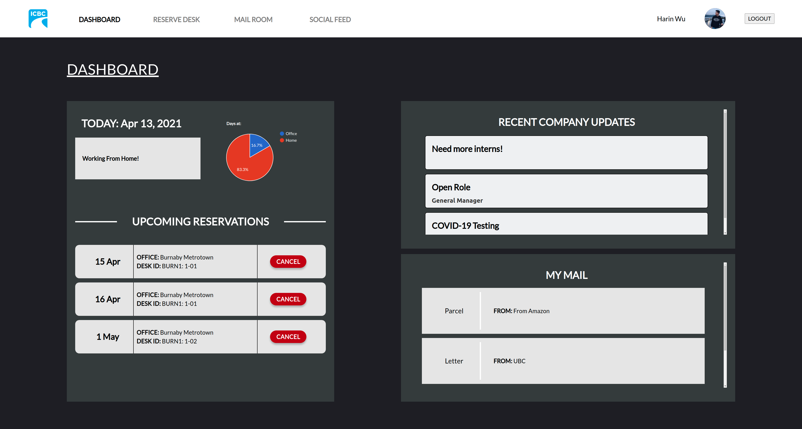
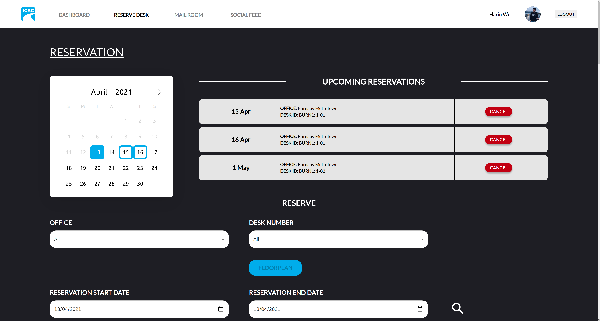
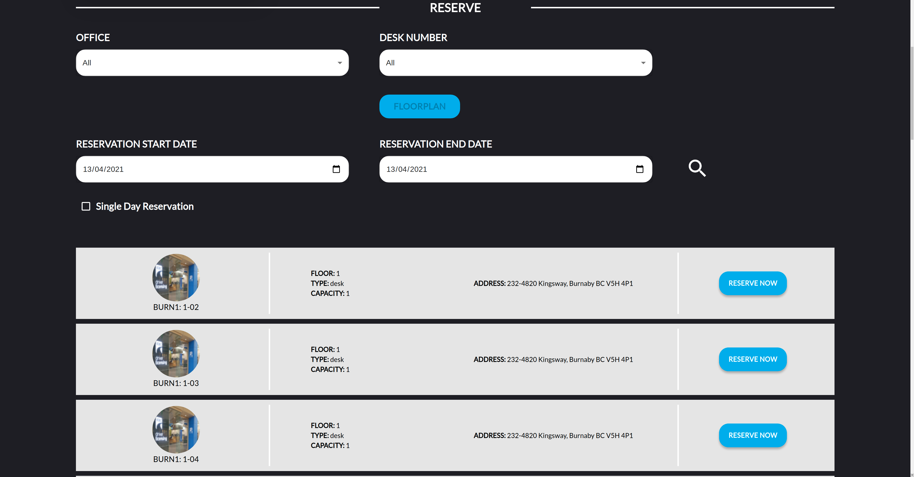
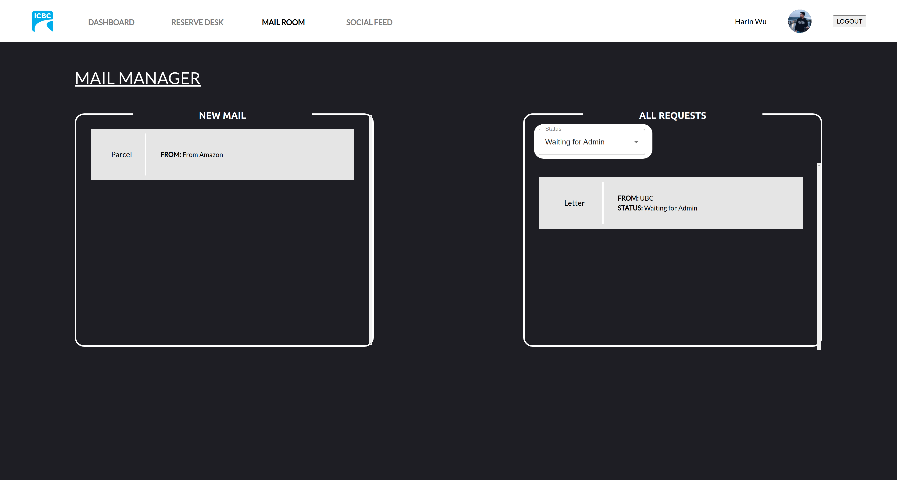
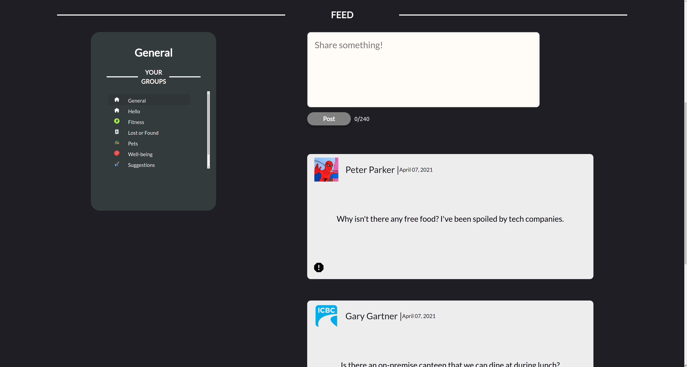
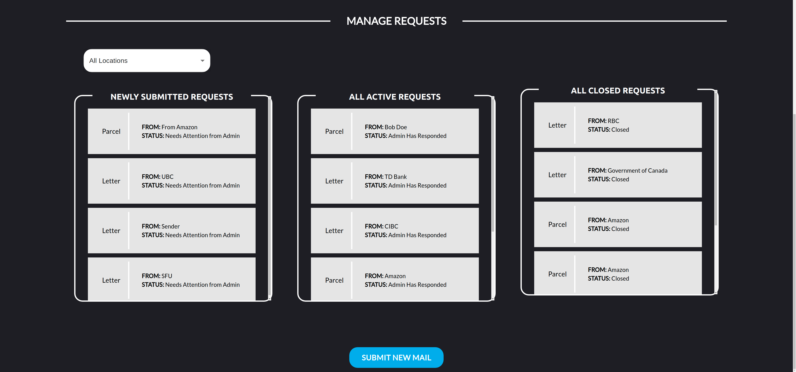

# Welcome to DeskBuddy!

CPSC 319 ICBC project built with React.js, Node.ts, mySQL. See it live [here](https://d2y5vcfqq9yc1u.cloudfront.net/)

## Module 1: “Where I’m working”

- The end user interface should allow participants to voluntarily register when they will be scheduled at their home office.
- The staff member will identify the property and the desk location and register up to any days up to 6 months in advance of the current date.
- The system aggregates all registered staff dates and allows individuals to see how many ICBC employees are registered to be onsite for any given date and how many are on the respective floors (in buildings with multiple floors).
- The current standard browser within ICBC is Microsoft Edge 
- Participants can select their office from a list of locations/floors/location code via a various pick list.   
- An interface to a calendar is provide for ease of booking.
- The administration component of module should allow the administrator to update property locations and update floor plan visual layouts (ie: JPG static files) as needed.    
- The teams should devise a naming strategy to identify every desk at all properties (e.g. North VancouverBuilding #1, 4thfloorcan be‘NV4-02A’etc).

~~- Stretch Goal #1:  ICBC API documentation for the retrieval of staff id, name~~

~~- Stretch Goal #2:  The system will generate individual Outlook calendar entries(version 2016)for the days registered individuals.~~

~~- Stretch Goal #3: Link JPG map to a clickable hot spot to pre-fill the desk location code.~~

## Module 2: ”Staying Connected” 

- This module makes the transition to work-from-home to office seamless by providing up-to-date notifications and wellness tips; and, encouraging staff to stay connected through social media type features
- Allows staff toview the latest updates relevant for their location, COVID-19 News, Wellness tips, and other important announcements
- Generates conversation on topics of interest and connectionswith other ICBC staffwho have similar interests (ie: Cat lovers, Foody group).
- The administration component of this module allows the administrator to create categories for staff to create topics (ie: Pets, Sports, Music, Java,etc.) and monitor and delete postings (e.g. due to inappropriate use).

## Module 3: “Mail Management Concierge”

- This module enables employees to manage physical mail while maintain flexible work arrangements (e.g. combining work-from-home and in-office attendance).
- Within this module users can request helpregarding mail/parcels when they are not physically on site.
- The administrator component of this module allows the administrator to view, action, and provide feedback on the request. Request parameters include: Requestor nameand contactinfo, location, instruction type (hold, forward, open and assist);requested completion date, status (new, work in progress, closed).

## Non Functional Requirements
- Concurrent usage of up to 50 users at peak times with average 2 or 3.
- Performance to handleapproximately 1000 peak live active registrations in the systembut likely average volumes are in the 300 range.
- A DBA script to offload lapsed dates into an ‘archive’ table would be needed to maintain high system performance.

## Installation
### Database:

- Go to AWS Console and select RDS
- Create Database using the following configurations:
    Standard Create
    MySQL Engine Type, Version 8.0.20
    Select Free Tier
    Name database and create username and password
    Continue with the default settings, adjusting storage, VPC and custom settings as desired
    Turn on public access to Yes
    Create database
- Enter VPC Security Groups and ensure the inbound rules for the security group allows all traffic, all protocol, all range and accepts both IPv4 (0.0.0.0/0) and IPv6 (::/0) sources.
- SSH or use a SQL workbench to access the database, run init scripts provided in appendix to create tables and dummy data
  To run init scripts from terminal:
    Place the init scripts somewhere accessible by your terminal
    mysql -h <host> -P 3306 -u admin -p 
    Enter your mysql password
    `USE <database name>`
    `SOURCE <path to init_database.sql>` to create the tables and stored procedures. This may take a few minutes. It should repeatedly say “Query OK” while it executes.
    Optionally, run `SOURCE <path to init_sample_data.sql>` to populate the database with some sample data.

### Backend:

- On a command line, clone master repo with ‘git clone https://github.com/CPSC319-ICBC/DeskBuddy.git’
- cd into the backend folder
- Run ‘npm install’
- Create a file named ‘.env’ and enter the following:
    DB_HOST= <DB URL>
    DB_PORT=3306
    DB_USER= <DB Username>
    DB_PASS= <DB Password>
    DB_NAME= <DB Name>
    SERVER_PORT=3000
- Run ‘npm run devstart’

### Frontend:

- On a command line, clone master repo with ‘git clone https://github.com/CPSC319-ICBC/DeskBuddy.git’
- cd into the frontend folder
- Run ‘npm install’
- Enter src/config/Constants.jsx and ensure the endpoints are correctly corresponding to the backend
- Run ‘npm start’, or if on Windows, run ‘npm run windows-start’
